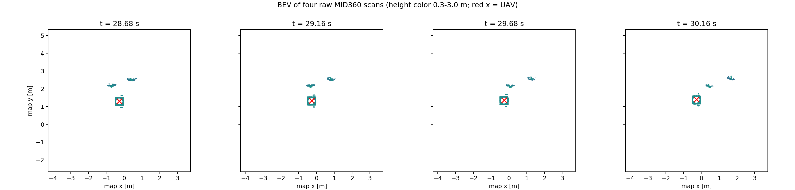
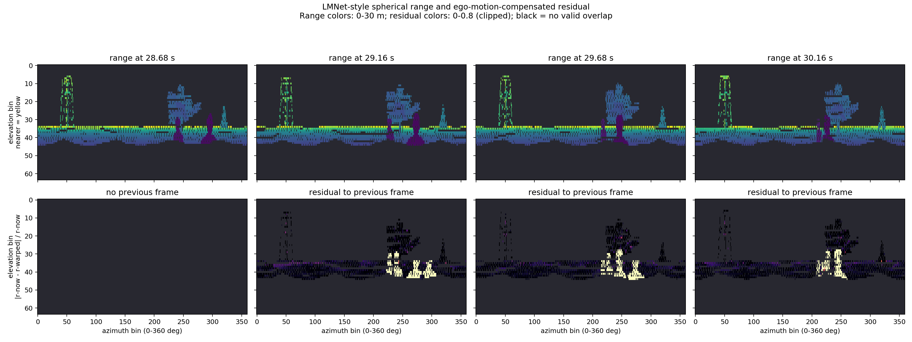
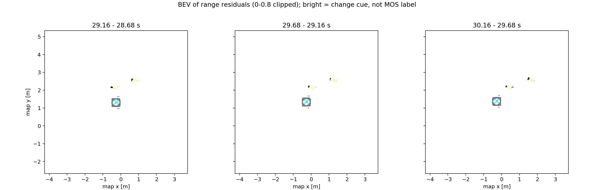

# MID360 四帧点云：BEV 与 LMNet 思路的量程残差

这是一项**离线观察实验**，不修改 `badcase/ours` 演示，不训练或运行 LMNet/SalsaNext，也不把残差直接作为动态分割标签。原始 [LMNet 论文](https://www.ipb.uni-bonn.de/pdfs/chen2021ral-iros.pdf)与[作者代码](https://github.com/PRBonn/LiDAR-MOS)使用球面量程图（range image）及运动补偿后的多帧残差作为网络输入；**BEV 鸟瞰图不是 LMNet 原网络输入**，这里额外提供它以便从地图平面观察行人与无人机。

## 输入和已生成结果

已有 ours 默认录包（例如 `dynamic_demo_runs/ours_20260923_214248.bag`）只保存地图、轨迹和检测结果，没有逐帧 `/livox/lidar`，不能从累计地图准确还原单帧量程图。因此本次使用**相同 `example.world` 的早期完整 badcase 录包** `dynamic_demo_runs/badcase_20260923_194722.bag`。这只影响可视化的数据来源，不表示以下图像是 ours 算法输出或 badcase/ours 性能对比。bag 中有 837 帧原始 MID360 点云、FAST-LIO 里程计和 Gazebo 模型位姿。

自动选取行人已移动、无人机起飞后，人机模型中心水平距离最小的时刻附近四帧，bag 相对时间为 28.681、29.162、29.682、30.157 秒；每帧 20,000 个原始点。事件中心处 Gazebo 人机中心 XY 距离约 0.984 米，仅用于选帧，**不是逐点动态真值或机体表面净空**。







生成文件在 [`analysis_outputs/lmnet_mid360_crossing`](../analysis_outputs/lmnet_mid360_crossing/metadata.json)：三张 PNG、`sampled_frames.npz`（四帧传感器/地图坐标点云及量程/残差数组）和 `metadata.json`（时间、重叠像素、残差统计及投影参数）。原始 bag 未修改。

## 计算过程和图像判读

1. 读取 `/livox/lidar` 的 XYZ 与 `/uav1/fastlio/odom`。用相邻里程计线性插值位置、球面线性插值四元数，并读取 `FAST_LIO/config/mid360.yaml` 中的 LiDAR→IMU 外参。把上一帧先变换到 `map`，再变换到当前 LiDAR 视点，以消除估计的无人机自运动。这里采用一帧一个位姿的近似；没有对每个 Livox 点的独立采样时间重新去畸变。
2. 当前点云及重投影历史点云分别按方位角/俯仰角投影到 `64×360` 球面格子，同一格保留最近量程。俯仰显示范围为 `[-45°,45°]`，最大显示量程 30 米。这是为 MID360 稀疏非重复扫描选的**可视化分辨率**，不是作者网络的固定输入规格。
3. 只对前后两帧都有有效量程的格子计算 `d(u,v)=|r_now(u,v)-r_prev→now(u,v)|/r_now(u,v)`；其他像素保持 `NaN`，画面中呈深色。第一帧没有前一帧，因此残差为空。彩色残差图为了观察把大于 0.8 的值截到色条顶端，NPZ/JSON 中保存原始值。
4. BEV 使用同一 `map` 坐标系，展示高度 0.3–3.0 米的原始点；红/青叉是无人机估计位置。`bev_residuals.png` 把当前点所落量程格子的残差回投到平面，便于定位变化区域；它不形成检测框或目标类别。

本组相邻帧有效量程格的重叠比例约 0.74–0.79，残差中位数约 0.029–0.032。图中行人横穿附近有明亮的变化线索，但树木、地面边缘、遮挡/显露、MID360 非重复采样、近距离机体回波和位姿/外参误差也会产生高残差；有些原始 95 分位值大于 5，正说明**阈值化残差不能直接当作“人已被准确分割”**。没有逐点标签，不能由这些图计算 Precision/Recall。

## 独立复现

```bash
cd /home/a/AstraDroneOpen
source /opt/ros/noetic/setup.bash
python3 analysis/lmnet_style_visualize.py \
  dynamic_demo_runs/badcase_20260923_194722.bag
```

默认生成一个新的、不会覆盖已有结果的 `analysis_outputs/lmnet_<bag名>_<时间>/`。可用 `--event-seconds 29.4` 指定从 bag 开始计的观察时刻，或用 `--height`、`--width`、`--elev-min`、`--elev-max`、`--bev-half-width` 改离线画图参数。若以后希望直接抽取 **ours** 的原始雷达帧，需要在运行已有脚本时使用它原本支持的 `--full-bag` 录包选项；本次没有为此改动 demo，也没有重跑 ours。缺少 `/livox/lidar` 的 bag 会明确报错。

论文中可写“参考 LMNet 的时序量程残差思想制作离线可视化”，**不可写**“复现了 LMNet 分割”“使用了 LMNet 的 BEV 网络”或“此残差图证明本系统动态分割精度”。
