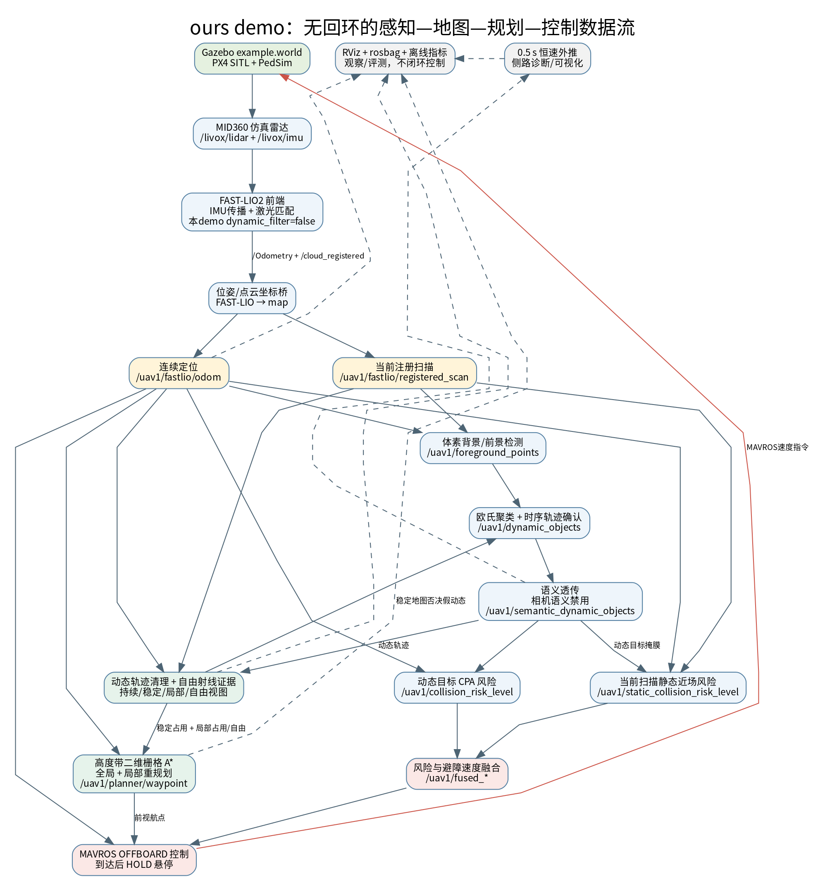

# ours 演示：技术、模块、作用与数据流

适用对象：`bash scripts/run_sh/dynamic_comparison_demo.sh ours` 所启动的**无回环动态建图与避障演示**。以下是对当前启动器、launch、配置和节点源码的梳理，不把仓库中“有代码但此演示未接入”的功能算入 ours。演示采用 `simulation/astra_gazebo_worlds/example.world`，PX4 SITL/Gazebo Classic 提供无人机与雷达仿真，PedSim 驱动行人横穿；目标为起飞后沿地图 `+Y` 约 12 米并到达后悬停。

可放大查看[矢量关系图](ours_demo_modules.svg)，也可修改[Graphviz 图源](ours_demo_modules.dot)后重新生成。实线是控制或地图数据链，虚线是仅用于诊断/展示的侧路；红线是控制指令回到仿真的闭环。最重要的反馈是：`stable_static_map` 除了供规划，还为动态轨迹确认提供静态支持否决；当前局部占用与自由空间又反过来修正全局地图造成的规划偏差。

## 实际启用的技术和模块

| 层次与技术名称 | 本 demo 的实现、输入→输出 | 作用及可见效果 |
|---|---|---|
| 仿真平台：Gazebo Classic、PX4 SITL、MAVROS、PedSim | `example.world`、MID360 模型及 `astra_pedestrians.launch`；运行器 `run_dynamic_comparison.py` 启动各进程 | 提供相同场景、行人横穿、机体动力学和真值；不是真机安全验证。 |
| 雷达/惯性：MID360 非重复扫描仿真 | `/livox/lidar` + `/livox/imu` → FAST-LIO2；模型见 `simulation/astra_gazebo_models/mid360/mid360.sdf` | 获取密集但非重复的三维扫描；扫描方式也带来跨帧对应稀疏和假变化风险。 |
| 激光惯性里程计：[FAST-LIO2](https://arxiv.org/abs/2107.06829) | `FAST_LIO/src/laserMapping.cpp`、`IMU_Processing.hpp`：IMU 传播、点云去畸变、scan-to-map 迭代更新及 ikd-Tree 增量地图 → `/Odometry`、`/cloud_registered` | 给感知、地图、规划和控制提供连续位姿与世界系扫描。**本演示启动参数 `dynamic_filter:=false`**，历史添加在 FAST-LIO 内的几何动态入图过滤器没有参加此次对照。 |
| 坐标桥：初始 ENU/map 对齐 | `fastlio_bridge.cpp`、`cloud_bridge.cpp`：FAST-LIO `camera_init` 数据与 PX4 初始局部 ENU 对齐 → `/uav1/fastlio/odom`、`/uav1/fastlio/registered_scan` | 下游在共同 `map` 坐标系中使用点云和定位；没有把 bridge 位姿反灌 PX4 估计器。 |
| 前景候选：体素背景与近场 ROI | `dynamic_detector.cpp` + `config/dynamic_detector.yaml`：当前注册扫描、里程计 → `/uav1/foreground_points` | 初始背景筛掉重复静态体素；2026-09-24起关闭永久在线静态学习，防止暂停/重复经过的行人被吞入背景。仅给出**候选前景**，视角变化和树叶仍需后续运动/静态支持门控。 |
| 动态确认：欧氏聚类、关联、时序运动一致性 | `dynamic_cluster.cpp` + `config/dynamic_cluster.yaml`：候选点与稳定静态地图 → `/uav1/dynamic_objects`、`/uav1/dynamic_points` | 将前景聚成目标并跨帧匹配、估计速度；连续运动及轨迹线性/拟合门限确认动态，高支持静态地图可否决树冠等假目标。它不是此演示中的独立 Kalman 节点，也不保证每个行人都被正确分割。 |
| 语义接口：关闭语义推理的透传 | `semantic_fusion.cpp` 在 `enable_semantic=false` 时将 `/uav1/dynamic_objects` 透传成 `/uav1/semantic_dynamic_objects` | 保持下游统一对象接口。**没有运行相机语义网络、LMNet 或 SalsaNext**；话题名包含 `semantic` 不代表完成语义分类。 |
| 动态地图维护：哈希体素、轨迹掩膜、自由射线证据 | `static_map_builder.cpp` + `config/static_map.yaml`：注册扫描、动态对象、里程计 → `/uav1/fastlio/cloud_map`、`/uav1/stable_static_map`、`/uav1/local_static_map`、`/uav1/local_free_space` | 持续地图保留跨帧占用，稳定层要求多帧命中，局部层保留近处新障碍并随帧龄消退；已确认运动轨迹回溯清理旧体素，自由射线多次穿过后删除旧占用。几个发布地图是同一 `cells_` 存储派生的视图，**不是 FAST-LIO 内部 ikd-Tree 被清除**。 |
| 全局/局部路径规划：高度带栅格膨胀 + A* | `static_path_planner.cpp` + `config/path_planner.yaml`：稳定地图、局部占用/自由、最终目标与里程计 → 全局路径、局部路径、前视航点 | 先用稳定占用求全局路线，再用当前局部自由空间覆盖旧障碍、局部占用回填并重新求到目标的路线；旧全局图完全封路时也可尝试局部证据修复。它是固定高度带二维规划，**不是三维动力学轨迹优化**。 |
| 动态碰撞风险：相对运动与最近接近点 CPA | `collision_risk.cpp` + `config/dynamic_risk.yaml`：动态对象、里程计 → 风险级别与建议避让速度 | 依据目标距离、相对速度、预测最近接近距离/时间设置减速或紧急避让；目标移动/暂时遮挡时有保持与释放机制。 |
| 静态近场风险：当前扫描表面距离 | `static_collision_risk.cpp` + `config/static_risk.yaml`：**新鲜**注册扫描、里程计、动态目标掩膜 → 静态风险与避让速度 | 不等待低频全局地图更新即可对近处树木/墙体制动；用动态目标掩膜减少与动态风险重复计数。这里的安全距离参数是模型与点云近似，不等于实测机体表面净空。 |
| 风险融合：静/动态分级与速度合成 | `avoidance_fusion.cpp` + `config/avoidance.yaml`：两路风险 → `/uav1/fused_collision_risk_level`、`/uav1/fused_avoidance_velocity` | 让规划航点控制同时受静态与行人安全约束；紧急风险优先于继续追目标。 |
| 飞行控制：OFFBOARD、航点跟踪、HOLD | `mavros_avoidance_controller.cpp` + `config/astra_mavros_controller.yaml`：航点、里程计、融合风险、MAVROS 状态 → `/mavros/setpoint_velocity/cmd_vel` | 预发送速度指令、请求 OFFBOARD/解锁、升到目标高度；正常时跟踪前视航点，风险升高时让行/逃逸，目标附近持续发悬停指令。只供仿真，真机需重新审查。 |
| 观察与监测：RViz、系统 watchdog、rosbag/离线脚本 | `dynamic_marker.cpp`、`system_watchdog.cpp`、`rviz/astra_dynamic_avoidance.rviz`、`analyze_dynamic_demo_bag.py` | 显示当前扫描、地图、轨迹、风险和路径；检测消息链路超时；用 Gazebo 真值与 bag 生成报告。它们用于诊断和评估，不构成新的避障决策算法。 |

额外启动的 `dynamic_predictor.cpp` 以恒速模型发布约 0.5 秒预测对象 `/uav1/predicted_objects`，**该话题没有接入本演示的 `collision_risk` 输入**；安全链中的 CPA 预测由 `collision_risk.cpp` 自己计算。仓库中另有 `dynamic_kalman_tracker.cpp`、回环后端与 FAST-LIO 几何过滤器，但这个一键 ours 运行链没有使用它们。不要把“仓库存在”误写为“本次演示实际启用”。

## 关键数据关系与地图边界

2026-09-24 工程补充：动态球使用真实轨迹 ID，目标丢失即删除，0.5 秒生命周期防止永久残留；红色为实测确认目标、橙色为短期预测。输出位置平滑系数 `position_alpha=0.65`，运动证据历史仍以 `motion_position_alpha=0.20` 平滑，显示响应与运动确认门限分离。检测范围仍为无人机周围 6 米，不能把出范围/静止后的空对象数组理解成节点停止。

行人新增 `PedSim → scripted_agents → pedestrian_control → simulated_agents → Gazebo` 单写者转发链，完成横穿后才允许键盘选人接管，不用传送或重新插入模型。导出旁路 `cloud_map → save_navigation_map → binary PCD + JSON` 直接保存 RViz 导航地图的有限 XYZ，报告时及退出前保存，可手动触发；不会修改 FAST-LIO 的 ikd-Tree，也不以 Gazebo 真值裁点。既有关系图只表示感知/规划主链，新增展示旁路以本段为准。

主链为：`MID360/IMU → FAST-LIO2 → 坐标桥 → 当前注册点云 + 连续里程计 → 前景检测/动态确认`。此后分三路：

1. `动态对象 + 当前扫描 → 可变地图的持续/稳定/局部/自由视图 → 全局 A* + 局部重规划 → 航点`。
2. `动态对象 + 里程计 → 动态 CPA 风险`，同时 `当前扫描 + 动态掩膜 → 静态近场风险`，两者融合为控制约束。
3. `航点 + 融合风险 + 里程计 → MAVROS OFFBOARD 速度 → PX4/Gazebo`；RViz/bag 旁路记录输出。

这里的 `/uav1/fastlio/cloud_map` 由 bridge 侧的 `static_map_builder` 维护，与 FAST-LIO 内部定位用的 `Laser_map`/ikd-Tree 并非同一张可同步删除的地图。规划器的全局输入实际上是更保守的 `/uav1/stable_static_map`，不是直接拿全量 `cloud_map`。`local_free_space` 表示近期射线证据，不等于整片未知区域已经安全。静止的人是当前占用，不能因其“可移动类别”直接从即时避障中忽略；人离开后才利用后续观测清理旧占用。

## badcase 与 ours：实际改变了什么

两个模式共享世界、MID360、FAST-LIO 前端、动态检测/目标关联、静态与动态风险融合、安全控制器、目标和速度；组合消融只切换：

| 开关 | badcase | ours | 对可观察结果的设计影响 |
|---|---|---|---|
| `enable_dynamic_map_clearing` | false | true | 运动轨迹附近历史导航占用可被回溯清除。 |
| `enable_free_space_clearing` | false | true | 后续射线确认空闲后可以删除曾静止的人留下的占用。 |
| `enable_local_replanning` | false | true | 局部新障碍/空闲证据可改写后续路线。 |

此前同时间预算、各一次的无界面仿真样本：badcase/ours 到达用时约 **61.70/37.38 秒**、Gazebo 真值平面航程 **20.30/12.42 米**、行人旧位置稳定地图点数 **128/0**。但最小人机**中心**平面距离约 **0.979/0.965 米**，ours 并未改善；终点里程计平面误差约 **0.132/0.171 米**，ours 也未改善。两次实际行人轨迹与观测覆盖略不同，不能将本组结果分解为某一个模块的独立收益，不能声称“显著提高定位精度”“零碰撞”或“完全保留所有静态树叶”。数据和讲解见 [`DYNAMIC_DEMO_CN.md`](../AstraDrone_ros1_ws/src/SLAM/fastlio_bridge/DYNAMIC_DEMO_CN.md)。

## 文献/实现归属与汇报用语

FAST-LIO2、IMU 传播和 ikd-Tree 属于[原作者 FAST-LIO2 工作](https://arxiv.org/abs/2107.06829)。体素占用/自由观测思想已有如 [OctoMap](https://octomap.github.io/)；二维栅格 A*、CPA 风险、OFFBOARD 控制也不是本项目首次提出。地图维护与局部重规划在本项目中是**工程集成和待进一步消融的系统设计**。本 demo 不启用回环后端；早期回环单独实验有误约束使精度下降的负结果，不应借本演示宣称回环成功提升精度。离线 LMNet 风格量程残差图是另一项**诊断可视化**，不是当前避障闭环的输入，详见 [`LMNET_STYLE_VISUALIZATION_CN.md`](../analysis/LMNET_STYLE_VISUALIZATION_CN.md)。

汇报可说：“我们以 FAST-LIO2 提供连续定位和注册扫描，在其上维护可更新的导航地图，并让局部占用/自由空间证据参与重规划；动态与静态风险分路评估后约束 PX4 控制。一次相同场景的内部组合消融显示旧位置残留与绕行在 ours 样本中减少，同时最小中心距离和终点误差没有同步改善；后续需要重复试验与单模块消融。”
