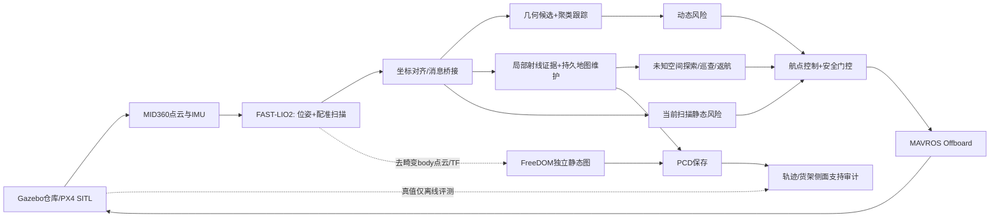
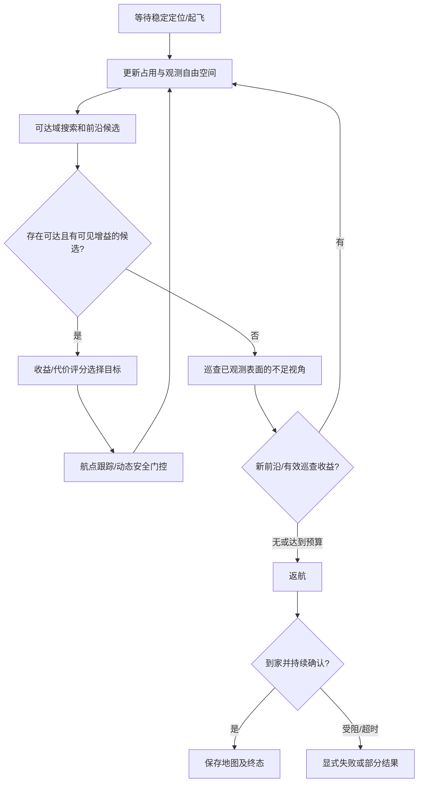

# 动态环境下无人机激光建图、地图维护与自主探索：组会全量素材

> 文档日期：2026-10-05（Asia/Shanghai）。项目根目录：`/home/a/AstraDroneOpen`。
> 用途：供后续 Codex 制作组会 PPT、图表和讲稿；不是论文定稿，也不是新一轮实验报告。
> 配套文件：同目录 `02_组会PPT总体大纲.md`。
> 本次工作：读取完整交流/学术记录，核对当前源码、配置和已有实验产物，整理材料。没有新跑飞行、没有修改算法、没有重新测量 CPU 或碰撞率。

## 0. 给后续 PPT 生成器的执行说明

1. 先读本文件，再读总体大纲。默认制作中文、16:9、约 35–40 分钟的研究进展汇报；时长可由用户另定。
2. 主线不是“堆了很多算法”，而是：**动态物体留下旧占用 → 旧占用影响路径 → 局部证据更新持久地图 → 规划重新利用空间 → 推进到自主探索 → 用外部基线发现静态结构缺失问题。**
3. 主讲使用 S01–S30；细节移入附录。每页只保留一个结论，公式和参数不要全塞到主讲页。必须保留失败案例、FreeDOM 适配边界及落地限制。
4. 本文所有项目相对路径均相对于上述根目录；不是相对于本 Markdown 所在目录。读取图片和数据时先拼接根目录。文中的通配前缀不是可直接打开的文件名。
5. 证据编号 E01–E08、图表编号 F01–F18、参考文献编号 R01–R28 为跨文档关联标识。参考编号沿用学术记录，R05、R12 含多个条目。
6. 图可用可编辑矢量框图、表格和真实数据曲线。没有真实数据时只能画机制示意图，并标“示意”；禁止生成看似真实的伪 RViz 截图、虚构点云、误差条或实验曲线。
7. 每个实验页必须出现：版本/日期、场景、指标单位、样本数或“单次试验”、证据路径、限制。不能把历史 example 结果配成当前仓库结果。
8. 引用使用原论文/作者仓库。文献调研、思想参考、源码迁移、实测复现是四种不同状态，不能都写成“已实现”。
9. 作者论文中的速度和精度不是本项目实测；GitHub stars、地图点数、截图好看不作为优越性证据。
10. 后续生成 PPT 时建议同时产出：可编辑 PPTX、逐页中文讲稿、引用与素材清单。这里只提供材料，不声称已经生成 PPT。

### 0.1 版本与证据纪律

当前 Git HEAD 是 `c639a0787cfb9e279383358d02e015271f3e9234`，但工作区有大量已有暂存/未暂存修改，包括探索、安全恢复与 FreeDOM 集成。**该提交不是本文全部功能的完整版本号**。复现实验需保存 dirty worktree 的补丁、配置、依赖和实际运行产物；不能只 checkout 此提交便声称复现当前版本。

本文状态标签：

| 标签 | 含义 | 可用于什么结论 |
|---|---|---|
| 当前实现 | 本轮源码/配置核验存在 | 说明结构与规则，不能自动证明运行效果 |
| 历史实测 | 已有原始 JSON/报告/PCD 可查 | 只支持对应日期和条件下的结果 |
| 历史测试记录 | 完整交流记录记载编译/测试 | 本轮未重新执行，不包装为新测试 |
| 文献参考 | 读过摘要、部分方法或作者代码 | 说明相关性，不代表全文复现 |
| 待实施/待验证 | 方案和研究计划 | 不放入“已完成贡献”栏 |

## 1. 汇报摘要：我们到底做了什么

可以这样开场：

“我们以 FAST-LIO2 为定位和点云配准基础，在 Gazebo/PX4 仓库仿真中搭建了动态感知、持续地图维护、路径更新和自主探索系统。重点不是把所有运动点简单删除，而是处理人离开后遗留的地图占用，让规划器能够重新利用已经恢复通行的空间。项目已经有可运行的导航和探索链路、地图导出与评测工具，也保留了回环误约束、静态结构误删、探索停滞和覆盖不足等失败案例。最近接入 FreeDOM 作为独立地图基线，发现现有维护图在货架表面支持方面仍有明显改进空间。”

### 1.1 三个不同的问题

| 问题 | 举例 | 解决对象 | 不能混淆的点 |
|---|---|---|---|
| 当前物体是否运动 | 行人在横穿 | 当前扫描/目标轨迹 | 静止人不会因此变成可穿越 |
| 历史占用是否仍存在 | 人已离开，地图还有轮廓 | 持久地图 | “当前没检测到人”不等于位置已空 |
| 地图是否足够支持任务 | 货架缺点、通道被假墙封闭 | 规划/探索和地图质量 | 返回起点或存出 PCD 不等于完整建图 |

### 1.2 当前完成度概览

| 能力 | 当前状态 | 汇报措辞 |
|---|---|---|
| MID360 模拟输入、FAST-LIO2 建图 | 已集成、有运行记录 | 激光惯性前端已接通 |
| 几何动态候选、聚类、跟踪、风险判断 | 已集成 | 无预训练网络的几何感知链 |
| 持久地图和局部观测更新 | 已实现、多次局部案例 | 能在重新观测条件下撤销旧占用 |
| 指定目标、避障、悬停、重规划 | 已有 example/仓库演示 | 固定高度下的导航原型 |
| 未知区域探索、巡查、返航、PCD 保存 | 已实现、一次长程返航 | 探索任务链完整，但全仓质量未达标 |
| FreeDOM | 已迁移为旁路基线 | 与 ours 同轮输出独立地图 |
| 回环后端 | 实验实现、主 demo 关闭 | 负结果推动更严格的回环验证 |
| 真机机载部署 | 未验证 | 目前是 SITL 原型，不是可交付无人仓库产品 |
| 学术贡献 | 工程系统与候选研究方向 | 尚不能声称已证明新的 SOTA 方法 |

## 2. 工作演进与问题驱动路线

早期日期无法从当前证据精确还原的部分，明确写“早期阶段”，不补造时间。

| 阶段 | 主要工作 | 学到的东西/遗留问题 |
|---|---|---|
| 早期：系统打通与源码学习 | pc_example 起飞、键盘飞行、话题检查、MID360 参数、FAST-LIO2 教学、world 切换和行人 | 位姿、坐标系、传感器配置与 PX4 控制必须先闭合 |
| 早期：动态点探索 | 参考 LMNet 时序差异；尝试纯几何三态筛选 | 非重复扫描与自运动会产生假差异，不能把新出现点当运动点 |
| 早期：EXP 功能迁移 | 动态检测、聚类跟踪、风险判断和避障接入现项目 | 模块有输出不代表导航行为合理，需要规划层而非仅斥力 |
| 2026-09-22/23 前后 | 回环后端与评估工具，随后保留无后端主线 | 接受回环约束不等于精度提高；错误约束可明显恶化轨迹 |
| 2026-09-23 | example badcase/ours、地图维护与局部重规划对照 | 单次结果显示残影和路线改善，但不是外部基线排名 |
| 2026-09-24 至 27 | 聚类后期更新、键盘行人、PCD 导出；迁移 cangku 仓库 | 展示工具和地图来源可追溯；低顶棚与窄通道暴露参数问题 |
| 2026-09-27 至 29 | 自主探索、自由射线证据、补扫、返航；启动与搜索优化 | 已知面积不等于完整表面；过激删除会掏空静态货架 |
| 2026-09-30 | FreeDOM 旁路迁移、安全停车和扫描时效门控 | 地图基线与飞行控制要分离，避免错误归因 |
| 2026-10-03 | 首货架停滞修复、短退路双重检查、完整一轮 SITL | 返航保存通过，仍因预算结束、覆盖不足；风险分支实飞验证不完整 |
| 2026-10-05 | 同轮地图审计与组会材料整理 | 将“能跑”推进到可解释、可复查、可设计对照实验 |

历史还涉及长走廊退化场景、真实数据集调研、R3LIVE/预训练模型方案、资源轻量化、备份与 GitHub 快照。这些不能全部算成已经部署的系统模块。备份与发布属于工程管理，不证明算法完成验收。

## 3. 系统总架构与代码入口

下图为**当前探索主线**。细实线为实际主链，虚线为旁路/离线评估。主讲页可将其重绘成 F02。



### 3.1 模块清单

以下 `B/` 简写仅在本章表格中使用，表示 `AstraDrone_ros1_ws/src/SLAM/fastlio_bridge/`。

| 模块 | 功能与上下游 | 主要源码/入口 |
|---|---|---|
| M01 仿真与传感器 | world、机体、雷达、IMU、人工行人 | `simulation/astra_gazebo_worlds/cangku.world`；`simulation/astra_gazebo_models/mid360/mid360.sdf` |
| M02 激光惯性前端 | IMU 预测、扫描去畸变、点面约束、状态更新 | `AstraDrone_ros1_ws/src/SLAM/FAST_LIO/launch/mapping_mid360.launch`；同包 `src/laserMapping.cpp`、`src/IMU_Processing.hpp` |
| M03 桥接 | FAST-LIO 初始帧与 MAVROS 本地坐标对齐，输出 map 帧数据 | `B/src/fastlio_bridge.cpp`、`B/src/cloud_bridge.cpp` |
| M04 动态感知 | 背景差异候选、聚类、时序关联、运动确认 | `B/launch/perception.launch` 下的 dynamic_detector / dynamic_cluster |
| M05 风险与控制 | CPA 风险、静态间隙、风险融合、速度与悬停 | `B/launch/astra_dynamic_avoidance.launch`；`B/src/mavros_avoidance_controller.cpp` |
| M06 地图维护 | 持久体素、稳定视图、局部占用、自由证据撤销 | `B/src/static_map_builder.cpp` |
| M07 指定目标规划 | 高度带二维 A*、历史地图与新观测融合 | `B/src/static_path_planner.cpp` |
| M08 自主探索 | 可达域搜索、前沿评分、巡查、恢复、返航 | `B/scripts/warehouse_explorer.py`、`exploration_grid.py`、`exploration_coverage.py`、`B/src/exploration_search.cpp` |
| M09 外部地图基线 | FreeDOM 扫描过滤/地图细化，旁路输出 | `AstraDrone_ros1_ws/src/SLAM/freedom/ASTRA_BASELINE_CN.md` |
| M10 评测与运行管理 | 进程生命周期、保存确认、真值对齐、覆盖审计 | `B/scripts/run_warehouse_exploration.py`、`warehouse_map_audit.py`；`B/test/` |

重要接线区别：

- `dynamic_cluster` 已负责关联和运动确认；不能因目录中有 `dynamic_kalman_tracker` 就画成当前已启动的独立 Kalman 跟踪节点。
- `dynamic_predictor` 的约 0.5 s 预测是独立输出/展示链；当前动态风险订阅 `/uav1/semantic_dynamic_objects`，不是直接订阅 `/uav1/predicted_objects`。风险节点自身做 CPA 外推。
- semantic_fusion 当前不等于接入语义网络；无人的语义类别保证。
- 探索版禁用普通目标 A* 节点，由 explorer 独占规划航点写入。控制器仍消费“规划航点”接口；这不意味着普通 A* 同时在跑。
- 主 demo 将 MAVROS vision pose 发布关闭。LIO 坐标对齐用于系统导航，但尚不能宣称完成无 GNSS 真机上 LIO 到 PX4 的状态估计融合。

### 3.2 数据与地图的职责

| 数据 | 坐标/含义 | 用途和边界 |
|---|---|---|
| `/cloud_registered_body` | FAST-LIO 去畸变的 body/IMU 帧点云 | FreeDOM 输入必须配对应 TF，不能误当 map 点 |
| FAST-LIO 内部 ikd-Tree | 前端匹配参考 | bridge 清图并不回写此树 |
| `/uav1/fastlio/cloud_map` | map 帧的外部维护图 | 导航/展示/导出，不是原始前端内部地图的同义词 |
| 稳定地图视图 | 更高观测次数要求 | 稳定不等于永久不可删，静止人体也会变稳定 |
| 滚动局部占用/自由观测 | 近期、有限空间 | 支持局部安全和旧占用证据更新 |
| `/uav1/freedom/static_map` | camera_init 帧独立地图 | 目前不进入 explorer 或 controller |
| Gazebo 真值、world 碰撞盒 | 仿真世界参考 | 用于场景、人工行人约束和离线评估，不给无人机先验路径 |

“双地图”在这里更准确地说是**持久存储加多个地图视图**：global/stable/local/free 并非两套彼此完全独立的 SLAM 地图。对外更新 cloud_map 不代表修正了 FAST-LIO 状态估计。

## 4. 核心原理、机制和规则

### 4.1 FAST-LIO2：为什么不是单靠 IMU 积分

IMU 以角速度和比力传播姿态、速度、位置，并估计偏置；仅靠积分会随噪声和偏置漂移。激光扫描经运动补偿后变换到地图，与局部平面形成残差，迭代误差状态滤波更新状态，随后增量维护地图。此处是教学概括，不是完整推导。

典型点面残差：`r_i = n_i^T (R p_i + t - q_i)`。`p_i` 为经过外参处理的扫描点，`n_i,q_i` 为地图平面法向和参考点；实际状态还含速度、偏置、重力等。ikd-Tree 支持增量插入/删除与近邻查询。[FAST-LIO2 原论文](https://arxiv.org/abs/2107.06829)、[作者实现](https://github.com/hku-mars/FAST_LIO)。

当前主 demo 使用 `sim_lidar:=true dynamic_filter:=false`：Gazebo 的 PointCloud2 走 `lidar_type=4` 模拟输入，而真实 Livox CustomMsg 对应 type=1。独立 launch 中 dynamic_filter 默认 true，**不要只看默认值就误报 demo 生效配置**。

早期三态 UNKNOWN/STATIC/DYNAMIC 前端过滤代码仍存在，但现在主演示关闭它。主线是前端定位与外部地图维护分离，避免把所有尚未获得时序支持的新表面一开始就挡在地图之外。

### 4.2 MID360 非重复扫描与自运动

同一物体不同帧被采样的位置不一样。飞机移动、配准误差、遮挡变化还会改变可见点。因而：

- 点集合差异不等于物体运动；未命中某体素不等于该体素为空。
- 应在共同坐标系比较，并结合静态地图支持、目标轨迹、实际射线和多帧证据。
- 未接收到某方向的点不能自动生成“穿过障碍物的自由射线”。

本地雷达模型配置为 10 Hz、每帧名义 20000 点、量程 0.2–40 m；名义范围噪声为 0，明显比真机理想化。CSV 扫描模式有 `vertical_angle_offset_deg=15`，注释说明模拟俯仰范围约从 -7.2°～52.2° 调到 -22.2°～37.2°。这是模拟采样偏移，不能写成 MID360 硬件改变视场角，也不等同完成真实安装角外参标定。FAST-LIO 的 `fov_degree=360` 是软件视场处理参数。

IMU 模型中传感器更新与插件字段并不完全一致；不要凭配置单个数字宣称实测 IMU 频率，演示需用 rostopic 测量。

### 4.3 动态感知：候选不直接等于运动目标

处理过程：体素背景差异 → 空间聚类 → 邻近目标关联 → 历史位移/速度/线性轨迹一致性 → 连续确认/退出 → 显示与风险。

当前配置代表值：

| 规则 | 代表参数 | 作用/代价 |
|---|---|---|
| 背景与范围 | 背景体素 0.25 m、40 帧历史、ROI 6 m | 限制计算和采样波动；超范围人不显示不一定是失效 |
| 聚类 | 容差 0.55 m、4–1000 点 | 小簇噪声抑制；稀疏远处人体可能漏检 |
| 关联和平滑 | 匹配约 0.8 m；位置 alpha 0.65、运动证据 alpha 0.20 | 分开“显示跟得上”和“判定不抖动” |
| 运动确认 | 位移 0.20 m、速度 0.30 m/s、窗口 0.5 s、线性度 0.82 | 多条件抗树叶/采样误报；慢速或转弯需进一步验证 |
| 连续门控 | 运动确认 4 次、静态退出 3 次 | 减少单帧闪烁，但有确认延迟 |
| 静态支持 | 支持半径 0.35 m、比例 0.6 | 降低静态结构被当运动簇的概率 |
| 可视化生命周期 | 空对象删除、约 0.5 s 过期 | 不让旧球留在 RViz 冒充当前感知 |

参数是配置代表值，近距离另有门限；PPT 不必逐项读，重点讲多证据和代价。当前没有完整逐点动态标签评测，不能说准确率/召回率达到某水平。球是确认运动簇，不是语义人体框。

### 4.4 从旧版轨迹擦除到当前射线证据更新

旧版 example 对照含运动目标轨迹附近的柱形清理。优点是快、容易消除鬼影；缺点是误报目标或过大半径可能擦掉货架、树等静态结构。

当前探索版启用 `evidence_only_clearing=true`：轨迹圆柱不能直接授权删除，也不以动态掩膜直接阻止当前点入图。删除依赖真实回波提供的反证。

规则顺序（对应 `static_map_builder::updateEvidenceFreeSpace`）：

1. 扫描和位姿时间配对，最大绝对差约 0.08 s；传感器原点考虑姿态与外参平移。
2. 由传感器原点到有效回波建立射线，最长 6 m，并在回波前保留 0.30 m 余量。
3. 旧地图点必须确实靠近射线，点到射线距离不超过约 0.06 m，且位于回波之前，才产生空闲反证。
4. 当前回波及其 27 邻格保护，避免把这帧真实命中的物体擦掉。
5. 同一帧对一个体素不重复刷证据；上次命中距今至少约 0.5 s 后才考虑负证据。
6. 负证据有时间连续性要求，间隔大于约 1 s 或无效时重置；不无限累计陈旧反证。
7. 普通旧占用需要约 3 次负证据；至少 8 次命中的稳定体素需约 6 次。重新命中会重置删除计数。

这不是严格贝叶斯概率、不是完整空体积判定、也不是 FreeDOM/DUFOMap 的完整实现。射线细、视角不足、点位误差与体素离散仍可能引起漏清或误删。必须同时测“动态残留下降”和“静态结构保留”。

持久图体素约 0.15 m：global 最少 2 个不同帧命中，stable 8，local 1；局部半径 6 m/15 帧，图发布约 2 Hz、总量设上限。限制资源不等于无损压缩，也不能把地图发布频率当作雷达频率。

### 4.5 地图如何影响规划

指定目标版：维护图给出全局占用；局部自由证据与旧点在三维上匹配，撤销失效占用，再进行投影与膨胀；最新局部实占用优先，防止“历史上空过”就把眼前障碍放通。顺序重要：过早投影和膨胀会把不同高度的空闲/占用混为一谈。

普通 A* 搜索使用高度带，网格约 0.10 m，障碍膨胀约 0.80 m；局部目标前视约 0.60 m。搜索边界可从 4 m 扩到 8/12 m；同目标保留已扩展范围。路径仍有效时，新路线改善约 25% 才切换，以减少抖动；旧路失效应立即重新规划。该切换规则并不保证全局最优。

这里不是完整三维、动力学约束轨迹优化，不能等价于 EGO-Planner、SUPER 或 DYNUS。

### 4.6 安全距离到底是什么

| 层级 | 代表配置 | 正确解释 |
|---|---|---|
| 机体包络 | 半径 0.40 m | 人工设置的圆形保守近似，不是自动从 SDF 精确计算 |
| 普通规划膨胀 | 0.80 m | 机心与占用的规划距离，含机体和余量；不再额外重复加半径 |
| 网格误差 | 0.10/0.20 m 网格半对角约 0.071/0.141 m | 离散规划仍需考虑角点与通道离散化 |
| 仓库静态风险 | 净余量 0.30 m → 机心约 0.70 m；紧急 0.25 → 0.65 m | 与规划膨胀不是同一参数 |
| 动态风险 | 人机中心安全阈值约 1.35 m、紧急约 0.75 m | 不是人与桨尖真实间隙，也不是任意追撞保证 |
| 探索受限恢复 | 最低机心净空 0.45 m、短命令跨度 0.20 m | 仅用于从不满足正常安全域的位置退出，不是正常飞行允许的通道宽度 |

CPA 思想：相对位置 `p`、相对速度 `v`，`t*=clip(-p·v/(v·v),0,T)`，预测最近距离 `d*=||p+v t*||`，低相对速度须单独处理。当前预测时域约 1.5 s，并配紧急阈值、垂直门控、释放滞回。它是假定短时速度近似不变的风险规则，不是对人体未来轨迹的保证。

缩小阈值可能通过更多窄通道，也会减少定位误差、离散化和制动的余量。PPT 不将“贴障更近”列为无条件优势。

### 4.7 自主探索：不知道仓库布局，但有任务假设

explorer 不订阅 Gazebo 真值地图。它从 LIO、维护图、当前观测构建随观测扩展的二维栅格；有固定高度、有限地图容量、传感器范围、机体大小等先验，但没有预载每个货架位置。

主要流程：



搜索与评分：0.20 m 栅格、八邻域/禁止切角，安全距离 0.80 m；C++ 原生 Dijkstra 与 Python 回退保持相同语义。未知空间不能当自由穿越。候选可见未知收益通过遮挡检查，典型评分 `gain/(2+weighted_search_distance)`；这不是完整 FUEL 实现。

初始窗口半径约 12 m，观测接近边缘后扩展，最大约 200000 格；前沿搜索范围 6 m、最小可见收益 0.5 m²。规划约 2 Hz、可视化约 0.5 Hz。表面质量证据用 0.40 m 体素、至少 3 个不同时间戳和 2 个视向、视点基线约 0.75 m；这是已观测表面的质量代理，不是未知全世界的完整性分母。

### 4.8 停滞、安全恢复和结束标准

此前首货架停滞的接口问题：规划器认为起点不在安全连通域，控制器又独立慢退/固定停车，双方对“下一步可以做什么”的规则不一致。

当前修复：探索器只在观测自由空间内生成净空不下降、能回到正常 0.80 m 安全域的短退路；控制器再核验新扫描、同一目标、动态风险和短时速度。正常飞行增加前向约 0.80 m 扫描防护。没有可证实退路就停车；无进展持续约 30 仿真秒可显式 `STALLED_UNSAFE`，不能永远显示“正在探索”却不动。

完整结束必须拆开讲：

- **任务生命周期完成**：回到家附近 0.30 m 内持续 5 s，地图保存成功，可进入 COMPLETE。
- **观测可达空间探索收敛**：前沿和巡查收益满足规则；当前约 90 s 窗口、自由面积增益 <1 m²、新表面 <25、至少 3 次观测目标等。仅是任务定义下的在线判据。
- **预算结束**：任务仿真/墙钟预算约各 3600 s，返航有独立预算；预算触发后也可能回家保存，但应标 partial。
- **外部地图质量验收**：货架侧面支持、静态保留、残影和接触安全独立审计。上述任一状态都不证明全三维建图完备。

最新任务中 COMPLETE 与 `coverage_complete=false` 同时出现并不矛盾：它完成的是“返航保存流程”，不是“地图完整性验收”。

## 5. 用到了哪些项目，分别发挥什么作用

### 5.1 真实工程依赖与集成

| 项目/组件 | 在本项目中的位置 | 优点 | 适配/局限 |
|---|---|---|---|
| AstraDroneOpen 原工程 | 仿真、模型、ROS/PX4 演示底座 | 可复用飞行链和场景 | 当前增加大量本地改动，不等于上游原功能 |
| PX4 + MAVROS | SITL 飞控与 Offboard 命令 | 飞控与上层算法分层 | 单写者、坐标系、时效和失联处理是关键 |
| Gazebo Classic + RViz | 物理/传感器模拟与可视化 | 可控制场景、获得评测真值 | 理想化传感器，GUI 和物理负载不能算作机载算法成本 |
| FAST-LIO2 + ikd-Tree | 激光惯性定位/配准 | 无需依赖视觉纹理、增量地图高效 | 不自动提供可靠回环或长期动态清图 |
| 用户 EXP-main | 既有动态感知/避障工作的迁移来源 | 保留已有开发成果 | 不是经过独立复现的外部论文 baseline |
| PedSim/行人网格及自定义控制脚本 | 初始横穿或键盘移动 | 可重复制造停留—移动—离开场景 | 仓库人是网格位移/转向，不是完整骨骼步行动画 |
| PCL / Eigen / ROS | 点云、线性代数、通信 | 成熟工具链 | 工具采用不是方法创新 |
| FreeDOM | 当前唯一实际迁移的外部动态清图基线 | 保守自由空间与持续地图细化，可同轮比较 | 旁路运行；MID360 适配不是原论文完整配置 |

PX4 Offboard 的控制流要求应查[官方文档](https://docs.px4.io/main/en/flight_modes/offboard.html)。ROS Noetic 已于 2025-05-31 EOL，Gazebo Classic 于 2025 年 1 月 EOL；现有平台适合维持复现实验，但长期部署需规划维护/迁移。[ROS 公告](https://discourse.ros.org/t/ros-noetic-end-of-life-may-31-2025/43160)、[Gazebo 官方说明](https://classic.gazebosim.org/)。

### 5.2 FreeDOM 的具体迁移状态

上游：[LC-Robotics/FreeDOM](https://github.com/LC-Robotics/FreeDOM)，[RA-L 2025 论文](https://arxiv.org/abs/2504.11073)。本地记录的上游版本 `dcfd5690cafddf121a80bd8ea477807d9656748e`，保留 MIT 许可。该“后端”指地图细化，不是回环位姿图后端。

输入采用 FAST-LIO 去畸变 body 点云和匹配 TF；增加帧检查、运行接线、保存请求确认及结果路径记录。配置 `sub_voxel_size=0.10 m`、深度 2 对应约 0.40 m 自由体素、自由计数 6/回退 20、4 线程、raycast 最长 35 m。数值以本地 `freedom/config/astra_mid360.yaml` 为准。

当前关闭 raycast enhancement：尚未完成 MID360 扫描掩膜与缺回波含义验证，不能把非重复扫描的未采样角度误作空闲。关闭的原因是适配谨慎，不是声称增强本身无效。

两图分辨率、入图规则和点密度不同；ours 是 map 帧，FreeDOM 是 camera_init 帧。离线比较必须分别用对应对齐文件投到同一参考坐标。FreeDOM 未改变本次无人机航线，不能说“接入它之后导航变好”。

### 5.3 所有主要论文/项目学习索引

“阅读范围”以历史记录为依据；本轮重核核心作者入口，不声称全文通读全部论文。正式论文投稿前仍须复核出版元数据和最新代码许可。

| ID | 原论文/作者项目 | 学习/借鉴与优势 | 当前采用程度 |
|---|---|---|---|
| R01 | [FAST-LIO2](https://arxiv.org/abs/2107.06829)；[ikd-Tree](https://arxiv.org/abs/2102.10808) | 迭代滤波、直接点云配准、增量近邻结构 | 真正采用前端，并做过源码教学 |
| R02 | [LMNet / LiDAR-MOS](https://github.com/PRBonn/LiDAR-MOS)，[论文](https://arxiv.org/abs/2105.08971)，RA-L/IROS 2021 | 运动补偿后的时序差异；提醒几何差异与运动语义的关系 | 思想参考、离线 BEV/残差可视化；无 LMNet/SalsaNext 网络 |
| R03 | [Dynablox](https://github.com/ethz-asl/dynablox)，[论文](https://arxiv.org/abs/2304.10049)，RA-L 2023 | 高置信自由空间与在线动态检测 | 摘要/作者项目学习，未集成 |
| R04 | [OctoMap](https://octomap.github.io/)，Autonomous Robots 2013 | 占用、自由、未知及概率更新基础 | 概念参考，未采用完整 OctoMap 框架 |
| R05a | [ERASOR](https://github.com/LimHyungTae/ERASOR)，[论文](https://arxiv.org/abs/2103.04316) | 静态地图动态残留移除 | 调研，候选离线基线 |
| R05b | [Removert](https://github.com/gisbi-kim/removert)，IROS 2020 | 多分辨率距离图、删除后恢复静态点 | 调研；离线流程不可当在线闭环 |
| R06 | [SCV-OD](https://github.com/Yixin-F/DR-Using-SCV-OD)，TGRS 2024 | 曲面体素占用描述子，动态感知建图 | 作者说明学习；我们的普通体素不是 SCV-OD |
| R07 | [LT-mapper](https://github.com/gisbi-kim/lt-mapper) | 长期、多会话地图变化管理 | 后续精读参照，未部署 |
| R08 | [EGO-Planner](https://arxiv.org/abs/2008.08835) | 无 ESDF 的梯度局部轨迹优化 | 三维平滑规划替代方向，未部署 |
| R09 | [LIO-SAM](https://arxiv.org/abs/2007.00258) | 关键帧、因子图和回环约束 | 后端结构学习，不是当前估计器 |
| R10 | [Scan Context](https://github.com/gisbi-kim/scancontext-cpp)、[Scan Context++](https://github.com/gisbi-kim/scancontext_tro) | 场景描述与地点识别 | 自定义后端参考；不宣称完整复现 ++ |
| R11 | [GTSAM / iSAM2](https://borglab.github.io/gtsam/isam2/) | 增量非线性优化 | 学习；当前自定义后端用 Eigen/PCL，不是已接入 iSAM2 |
| R12a | [better_fastlio2](https://github.com/Yixin-F/better_fastlio2) | FAST-LIO 工程扩展和回环/动态模块组织 | 历史读取 c188ce1…；未整包部署，无本机速度排名 |
| R12b | [FAST_LIO_SAM](https://github.com/kahowang/FAST_LIO_SAM) | 前端与回环优化解耦思路 | 历史读取 757d122…；参考结构，无公平性能对照 |
| R12c | [FAST_LIO_SLAM](https://github.com/gisbi-kim/FAST_LIO_SLAM) | FAST-LIO 加 Scan Context 位姿图工程 | 已有工作明确实现此类目标；未整包作为主 demo |
| R13 | [R3LIVE](https://github.com/hku-mars/r3live)，ICRA 2022 | 激光惯性视觉融合、彩色地图 | 讨论过，未部署；不是动态去除替代品 |
| R14 | [NTU VIRAL](https://ntu-aris.github.io/ntu_viral_dataset/)，[论文](https://arxiv.org/abs/2202.00379) | UAV 多传感器与轨迹真值 | 数据集调研，未在当前系统完成跑分 |
| R15 | [dyn_small_obs_avoidance](https://github.com/hku-mars/dyn_small_obs_avoidance)，[论文](https://arxiv.org/abs/2103.00406) | FAST-LIO、动态小障碍感知、动力学规划 | 与整体系统最接近的已有方向之一，未移植 |
| R16 | [ROG-Map](https://github.com/hku-mars/ROG-Map)，[论文](https://arxiv.org/abs/2302.14819)，IROS 2024 | 机器人中心滑动地图、增量膨胀、资源效率 | 轻量化参照；局部滑图不等于持久全局地图 |
| R17 | [M-detector](https://github.com/hku-mars/M-detector)，[原论文](https://www.nature.com/articles/s41467-023-44554-8) | 遮挡关系与 LiDAR 点流运动事件，非学习方向 | 摘要/README 学习，未部署 |
| R18 | [SUPER](https://github.com/hku-mars/SUPER)，Science Robotics 2025 | 安全约束、备份轨迹与高速导航架构 | 作者项目学习，未替换控制器；标题不构成安全保证 |
| R19 | [DYNUS](https://github.com/mit-acl/dynus)，[预印本](https://arxiv.org/abs/2504.16734) | 动态未知环境的时空规划与不确定性 | 调研；历史说明有 ROS2/Gurobi 依赖，迁移成本需另核 |
| R20 | [FUEL](https://github.com/HKUST-Aerial-Robotics/FUEL)，RA-L 2021 | 增量前沿结构与分层探索 | README/方法概述；本项目简化探索不是 FUEL 复现 |
| R21 | [FreeDOM](https://github.com/LC-Robotics/FreeDOM)，[论文](https://arxiv.org/abs/2504.11073)，RA-L 2025 | 保守自由空间、扫描级过滤与持续地图细化 | 部分原文/源码学习，实际旁路迁移并有同轮地图 |
| R22 | [DUFOMap](https://github.com/KTH-RPL/dufomap)，[论文](https://arxiv.org/abs/2403.01449)，RA-L 2024 | 充分观测自由空间、动态历史点，作者有 MID360 展示 | 项目/摘要学习，未复现；MID360 本身不构成研究空白 |
| R23 | [ERASOR2](https://erasor2.github.io/)，[代码](https://github.com/url-kaist/ERASOR2)，RSS 2023 | 实例级静态世界重建 | 项目摘要/接口调研，未来离线图质量基线 |
| R24 | [Dynamic-LIO](https://github.com/ZikangYuan/dynamic_lio)，[论文](https://arxiv.org/abs/2407.03590) | 标签一致性辅助动态场景里程计 | 摘要/README 学习；非 FAST-LIO 即插即用插件 |
| R25 | [DynaLOAM](https://github.com/HITSZ-NRSL/DynaLOAM)，作者引用 Autonomous Robots 2025 | 动态检测结合位姿与子地图清理 | 作者项目学习；构建完整性和性能未验证 |
| R26 | [DynamicMap_Benchmark](https://github.com/KTH-RPL/DynamicMap_Benchmark)，ITSC 2023 | 动态移除与静态保留评测 | 评测协议参照，尚未正式跑分 |
| R27 | [Active perception network…](https://doi.org/10.1177/02783649241264577)，IJRR 44(2), 2025 | 非短视探索、视点与表面覆盖 | 摘要/可访问方法段学习，未复现 |
| R28 | [Diagnosing and Dynamically Filtering Occupancy World Models for Active Mapping](https://arxiv.org/abs/2609.06820) | 观测门控、错误占用与任务影响 | 历史部分原文学习；WORLDS workshop，不写 IROS 主会/RA-L；RGB-D 任务不同 |

数据集补充：SemanticKITTI MOS/LiDAR-MOS 可研究运动分割，HeLiMOS/FreeDOM 示例可研究多雷达动态清图，NTU VIRAL 偏无人机轨迹评估，Gazebo 提供闭环可控实验。不同数据集标签和传感器不同，不能用 UAV 轨迹数据自动算动态分割 IoU；离线回放也不能证明新动作下导航成功率。

## 6. 已有实验：哪些优势有证据，哪些没有

### 6.1 E01：example 内部 badcase / ours 组合消融

来源：

- `dynamic_demo_runs/badcase_20260923_201211_metrics.json`
- `dynamic_demo_runs/ours_20260923_200322_metrics.json`

两配置共享主体感知/控制链；区别是地图动态清理、自由空间更新和局部重规划组合。**badcase 不是原版 FAST-LIO2 的完整自主导航系统**。每种一轮，实际行人轨迹和记录时长不同，不能作严格统计结论。

| 指标 | badcase | ours | 可以怎么说 |
|---|---:|---:|---|
| 到达目标时间 / 仿真 s | 61.698 | 37.377 | 本次缩短约 39.4% |
| 目标发布后真值 XY 路程 / m | 20.296 | 12.423 | 本次缩短约 38.8% |
| 人离开初始 ROI 后维护图残留 / 点 | 287 | 0 | 该 ROI 最终残留下降，不是全图零鬼影 |
| 同 ROI 稳定图残留 / 点 | 128 | 0 | 稳定历史占用也能够被撤销 |
| 最小人机中心 XY 距离 / m | 0.979 | 0.965 | 没有更大安全间距，不能宣称安全提升 |
| 最终目标里程计 XY 误差 / m | 0.132 | 0.171 | 此指标没有改善 |
| 对齐后 FAST-LIO 3D ATE RMSE / m | 0.0183 | 0.0163 | 小差异不能归因于清图或宣称前端改进 |

建议结论：“单次内部对照说明地图更新与路线效率相关，支持继续研究；尚缺独立消融和重复实验。”不要标题写“ours 全面优于原始算法”。

### 6.2 E02：2026-10-03 完整一轮探索的任务结果

来源：`exploration_demo_runs/warehouse_20261003_222021_result.json`。

| 项目 | 结果 | 解释 |
|---|---:|---|
| runner termination | returned_home_and_saved | 返航与保存流程完成 |
| mission state | COMPLETE | 生命周期终态，不等同地图合格 |
| finish_reason | wall_budget_partial | 墙钟预算触发结束探索 |
| coverage_complete / exploration_complete | false / false | 必须与 COMPLETE 同页显示 |
| 到达/选取目标 | 93 / 97 | 目标计数，不是独立任务成功率 |
| stalled_goals | 3 | 记录中的停滞目标数，不应改称准确重规划总次数 |
| XY 航程 | 547.88 m | 单轮长程执行 |
| 回家 XY 误差 | 0.123 m | 在配置确认阈值内 |
| 已知自由面积 | 1187.00 m² | 在线二维自由区域，不是全仓 3D 覆盖 |
| 任务仿真时长 | 2174.94 s | 约 36.25 仿真分钟 |
| 记录墙钟时长 | 3833.27 s | 约 63.89 实际分钟 |
| 状态估计 RTF | 0.572 | 仿真推进/墙钟比，不是算法 CPU 使用率 |
| 已观测表面质量比例 | 92.65% | 14684/15849，不包括尚未观测表面 |
| 剩余巡查候选 | 234 | 仍有潜在质量不足，不能宣称扫完 |
| explorer 计算 P95 | 184.36 ms | 源码保留最近 120 次 tick 的统计，不是全任务/全系统 P95 |

历史测试记录：相关包编译通过、探索单测 51 项、runner 生命周期 3 项、假飞控检查 18 项；本轮文档整理未重新运行。真实 SITL 这轮没有触发待验证的风险 1/2 恢复分支，不能用假飞控通过代替真实接触安全实证。

### 6.3 E03：同一航次 ours 与 FreeDOM 地图审计

来源：

- `exploration_demo_runs/warehouse_20261003_222021_coverage.json`
- `exploration_demo_runs/warehouse_20261003_222021_freedom_coverage.json`

评价定义：对 52 个货架的外露碰撞盒**侧面**在世界高度 0.25–1.90 m 采样，间距 0.30 m，共 10192 个参考点；若地图点在 0.25 m 欧氏距离内则支持。遮挡/不可达表面仍留在分母。初始真值对齐用于评估，不修正长期漂移；这是代理几何指标，不是完整视觉网格真值。

| 指标 | ours 维护图 | FreeDOM 旁路图 |
|---|---:|---:|
| 支持参考点 | 9267 / 10192 | 10091 / 10192 |
| 总侧面支持率 | 90.92% | 99.01% |
| 最差单货架支持率 | 29.59% | 85.71% |
| 低于 90% 的货架数 | 10 / 52 | 3 / 52 |
| 总体 ≥95% 且每架 ≥90% | 未通过 | 未通过 |
| 最终保存地图点数 | 284418 | 756031 |

最后一行只说明输出规模，不能排名质量。结果支持：“这一航线、这一代理几何指标上，FreeDOM 保留/支持货架侧面更充分。”结果**不支持**：“FreeDOM 导航更好”“FreeDOM 全无鬼影”“ours 删除的全是静态点”“FreeDOM 已完成完整 3D 建图”。此指标混合了是否看到、采样密度、入图与删除效果，尚未单独测静态误删。

E02 status 中 `map_points=284442` 是运行时快照；导出 PCD 是 284418 点，不能把两者混用。这种末帧时间差不是自动判定文件损坏的依据。

### 6.4 E04：回环后端的负结果

来源：`loop_closure_runs/loop_closure_20260923_182256_report.txt`。

自定义后端参考关键帧、Scan Context 候选、ICP 验证和位姿图思路，采用 Eigen/PCL 优化实现。1772 个样本、177.1 s、真值路程 51.10 m；接受 2 条回环、58 关键帧、59 条边，优化器未报告失败，但精度反而变差。

| 在线发布轨迹指标 | RAW | OPTIMIZED |
|---|---:|---:|
| 对齐 ATE RMSE / m | 0.0113 | 0.0478 |
| 5 s 平移 RPE RMSE / m | 0.0097 | 0.0289 |
| 首尾位移误差 / m | 0.0333 | 0.0873 |

“求解成功”和“约束正确”不是一回事。重复货架/场景、起降阶段与错误匹配会干扰回环。主 demo 因而保持后端关闭。历史还有“最终优化 Path 重新评价”的另一套数值，评价对象不同；本 PPT 默认只使用此原报告在线轨迹表，不能混成同一实验口径。

### 6.5 E05–E08：补充证据与展示材料

| ID | 材料 | 能说明什么 | 不能说明什么 |
|---|---|---|---|
| E05 | `analysis_outputs/lmnet_mid360_crossing/metadata.json`、`sampled_frames.npz` 和三张 PNG | 真实 MID360 仿真帧的 BEV/时序残差可视化 | 不代表 LMNet 推理、网络精度或严格复现其输入管线 |
| E06 | `AstraDrone_ros1_ws/src/SLAM/fastlio_bridge/test/`；主记录 N049 完成项 | 单测、假飞控、长程 SITL 分层验证记录 | 本轮未重跑；没有零 bug/零碰撞证明 |
| E07 | `AstraDrone_ros1_ws/src/SLAM/fastlio_bridge/test/benchmark_exploration_search.py` 与历史提速记录 | C++ 搜索替代 Python 的性能研究入口 | 历史微基准不是全系统资源分析；PPT 没有原始样本时不画当前加速比 |
| E08 | `交流记录/交流与解决方案.txt`、`学术关联与论文写作记录.txt`、`RA-L研究路线_2026-09-30.md` | 设计演进、失败记录、候选学术路线 | 历史助手声明不能替代当前原始证据 |

## 7. 如何评价性能：已有数据与下一步测量

### 7.1 分层指标体系

| 层面 | 指标与定义 | 当前证据/待补 |
|---|---|---|
| 定位 | ATE、RPE；统一时间配对与刚体对齐 | example/回环已有；真实 UAV 数据未验证 |
| 动态检测 | 点级 precision/recall/IoU、目标首次确认延迟 | 没有完整动态标签，不可给准确率 |
| 历史清理 | 人离开 ROI 后残留、离开到清除时间、首次有效复观测到清除时间 | 部分 ROI 最终值已有；两种延迟待系统测量 |
| 静态保留 | 可见静态参考被错误删除的比例、薄结构/货架局部保留 | 当前侧面支持只是代理，需可见性和时间标签 |
| 地图质量 | 全局支持、逐架最差值、几何精度/厚度、覆盖分布 | 同轮侧面审计已有；全 3D 未通过 |
| 规划任务 | 成功率、路程、耗时、停滞次数、通道恢复时间 | 单次与历史任务已有，无同条件多种子统计 |
| 安全 | 碰撞次数、机体真实间隙、制动距离、错误开通率 | 中心距离不是碰撞真值；目前缺接触审计 |
| 资源 | 各节点 CPU、RSS、每帧/P95/P99 延迟、积压、丢帧、磁盘增长 | 局部 planner 统计有；系统资源基线未完成 |

建议公式：

- 侧面支持率 `C = 支持的参考样本数 / 全部声明参考样本数`。
- 残影比例和静态保留必须在统一评价体素上算，避免高密度地图天然点数更多。
- `RTF = 仿真时间增量 / 墙钟时间增量`；只用于仿真运行效率。
- 单次改变量 `(badcase-ours)/badcase` 可以描述观察，不能附无来源置信区间。
- 多次同条件实验再给均值/标准差、成功次数/总次数及失败分布，不把 93/97 个航点当 97 次独立飞行。

### 7.2 公平比较的实验设计（尚未完成）

第一层离线：固定同一组原始扫描和位姿，比较 ours / FreeDOM / 待接入 DUFOMap；相同 ROI、体素尺度、对齐、观测时域，因果在线方案不能偷用未来帧。现有并行运行是同一飞行输入源，不保证每节点处理完全相同的消息子序列；严格比较需记录输入序号/时间戳或确定性回放。

第二层闭环：将不同维护地图分别接入同一规划器/安全控制器，在相同场景、行人脚本、随机种子和预算下比较任务。只有这一层才能评价地图更新对新动作的反馈。

消融建议：A 原持久占用；B 仅射线撤销；C 加稳定/时效证据；D 加局部重规划；E 加任务相关主动复观测。保留安全实时占用层一致；不能为了展示好路线放宽 ours 的安全距离。

场景至少包括：静态薄货架、自运动且无行人、人先静止后离开、人始终未离开、人被遮挡、通道关键旧占用、非关键区域旧占用、不同布局。所有策略要报额外飞行/观察成本，而不只报清理后的好图。

## 8. 优点、问题与落地可行性

### 8.1 目前可以合理主张的优点

1. **形成了任务闭环**：不仅看运动球，还连接地图、路径、控制、保存和评估，能观察旧占用对行为的实际影响。
2. **定位与地图维护解耦**：便于保留成熟前端、替换清图模块和接入 FreeDOM 对照；也必须承认目前未改善前端动态污染。
3. **不依赖预训练语义网络**：当前主线无需额外神经网络权重和 GPU 推理部署；但不等于全系统已证明低 CPU/低功耗。
4. **地图删除越来越强调证据**：从轨迹粗擦除转向时间配对、真实射线、当前命中保护、稳定点多证据，规则可解释。
5. **具有可复查产物**：运行日志、状态 JSON、地图 PCD、对齐和逐货架审计，能暴露局部缺陷而不是只展示全局截图。
6. **已有可演示平台**：指定目标、人工行人、未知区域探索、返航保存和旁路基线可用于持续研究。

其中 1–6 多为系统/工程优点，不自动构成 RA-L 创新。E01 只为路线效率提供有限实测支持；E03 反而显示当前静态结构维护需要改进。

### 8.2 必须主动讲的限制

- 固定高度二维规划，无法保证货架背面、上层、低处及全部三维表面被观察。
- 最新任务预算返航，10 个 ours 货架未达逐架 90% 支持要求。
- 本轮尚不清楚每个缺口是未扫描、遮挡、体素过滤还是错误删除，需要逐点/逐时证据审计。
- 动态确认对距离、速度、遮挡、非线性运动敏感；无语义保证，也无完整标签评测。
- 清理必须重新观测；在人离开后无人机再没看过的位置，不应承诺无鬼影。
- 实时局部占用不能因全局图“清干净”就让人或未知空间变成可穿越。
- 无真正完整的三维动力学避障、制动可达性和飞控定位失效评估。
- 回环实验负收益，主线无回环；长期漂移仍可能影响地图一致性。
- CPU/内存/功耗和真实机载计算板未实测；没有物理碰撞真值支撑“零碰撞”。

### 8.3 真实落地分层判断

| 场景 | 可行性判断 | 进入下一阶段的必要条件 |
|---|---|---|
| 实验室 Gazebo 演示 | 已具备基础能力 | 冻结配置、准备录屏、保留失败/超时状态 |
| 真实雷达手持/地面采集 | 可作为下一步 | 实际驱动、时间戳、IMU 外参、数据格式、静态结构真值 |
| 半实物/机载计算回放 | 尚未完成 | 目标 CPU 上确定性回放，测端到端延迟、内存和积压 |
| 有保护的真机低速测试 | 尚不具备直接放飞证据 | LIO→PX4 估计融合、失联/定位故障处理、人工接管、物理防护 |
| 无人值守仓库自主建图 | 当前不满足 | 多布局/多次任务、接触安全、完整性与失败恢复、维护平台迁移 |

不用购买某个具体计算板也可先做：容器/CPU 配额回放、限制线程、统计消息负载和内存上限、在不同频率/密度下画性能曲线。但 x86 限核不能准确模拟 ARM 的缓存、内存带宽、指令集和热降频，不能替代目标硬件最终验证。

资源测量建议分四组：①仅 FAST-LIO；②加 ours 感知/地图；③加规划控制；④再加 FreeDOM。GUI 和 Gazebo 单独计费。每组记录硬件、编译参数、输入点数频率、线程数、RSS、CPU、P95/P99、队列深度、消息年龄、磁盘增长。先建立基线，再讨论“更轻”。

### 8.4 轻量化路线：先降低无效工作

优先级一：增量更新占用/膨胀，避免每轮重建全图；拆分低频持久图与高频局部安全图；限制消息队列、拒绝陈旧观测；可视化降频并与控制解耦。

优先级二：保留 C++ 可达域搜索，检查 Python 全图循环、点云复制和 ROS 序列化；用结构化缓存与局部块更新。参考 ROG-Map，但不能直接丢失持久全局地图需求。

优先级三：用明确误差预算选择体素/ROI/射线数量，做质量—延迟曲线。不能为了 RTF 直接稀释安全检查或将未知判空。

地图多分辨率和 FreeDOM 替换属于待比较设计，不是已证明提速。关闭 GUI 通常减轻仿真显示负担，但不能写成算法创新；已有修改物理步长导致稳定起飞门控不通过的失败，不应复用未经验证的仿真提速参数。

## 9. 学术定位与可发展的研究问题

### 9.1 不能作为创新点的宽泛说法

“FAST-LIO + 动态去除”“全局加局部地图”“自由射线清图”“A* 动态重规划”“主动观察”“MID360 适配”都有大量相关工作。FreeDOM 已明确讨论鬼影影响导航，DUFOMap 有 MID360 示例，APN/主动建图工作研究视点与覆盖，所以不能只凭这些关键词声称首创。

### 9.2 更具体的候选问题

**在非重复 LiDAR 和自运动条件下，如何以有限观察/计算预算确认影响任务的历史占用已经失效，同时避免误删静态结构和错误放通当前障碍？**

候选设计（未实现完整新方法）：

1. 旧占用维护“保留—待核验—可撤销”状态与证据来源，把遮挡、未观察和矛盾观察区分开。
2. 不为每个疑似鬼影都绕飞；按其是否阻断当前路径/重要前沿、核验代价和视角可获得性选择复观测。
3. 复观测后将清图结果与通道恢复/新路径因果关联，保留实时安全占用和不可观测状态。
4. 将相同核验策略也接到 FreeDOM/DUFOMap，比较“底层地图强”与“任务驱动核验”的独立收益，避免只与弱 baseline 比。

还需精读排重，尤其保守自由空间已经考虑噪声/位姿/入射角，不能换名当创新。可发表性取决于具体机制与充分实验，不承诺 RA-L 接收。

### 9.3 建议的短期工作包

| 工作包 | 可交付结果 | 成功判据 |
|---|---|---|
| W1 解释缺架 | 对 10 个低支持货架输出可见性、命中/删除时间线 | 能区分没扫到与误删，不凭截图猜原因 |
| W2 公平地图基线 | 固定输入回放 ours/FreeDOM，统一评价体素 | 同时报静态保留与动态残留、完整配置可复现 |
| W3 任务干预实验 | 同规划控制下切换地图/核验策略 | 通道恢复、停滞、路程和安全真实改善，保留失败 |
| W4 资源与实物数据 | 模块资源剖析、真实 MID360 bag 回放 | 满足预先声明延迟与内存预算，不仅平均速度 |
| W5 研究原型 | 任务相关待核验占用与主动复观测 | 多布局/多种子、对强基线也有增益，创新排重成立 |

可用于报告而非论文结论的表述：“目前完成的是一个可评测的动态建图与探索平台。下一步聚焦删除可靠性与任务相关复观测，不继续单纯叠加模块。”

## 10. 图表制作清单（供后续 Codex 直接执行）

每个 F 项都给出目的、数据/内容、画法与必须保留的限制。无需现在生成图；生成时先查看真实资产再裁剪，不能靠文件名猜图像内容。

### F01 问题引入：人离开了，地图中的墙还在

三联图：t0 人站立并入图；t1 人离开而旧占用保留；t2 有效自由观测撤销旧占用后路径变短。灰色静态货架、橙色人、红色历史残留、青色路线。可以画纯示意，无真实坐标；角标“机制示意，不是实验截图”。讲述“扫描分割”和“历史维护”不同。

### F02 系统总架构

重绘第 3 节 Mermaid。蓝色实线=当前主链，紫色虚线=FreeDOM 旁路，灰色虚线=Gazebo 离线真值。将“回环关闭”“无语义网络”“真值不进 planner”作为三个边界标注。不要把 FreeDOM 接到控制器。

### F03 项目发展时间线

采用第 2 节时间表，横向 6–8 个阶段；每阶段一条“问题→改动”。早期不标伪造日期。把回环负结果和缺架问题画成研究转折，而不是全绿成功链。

### F04 FAST-LIO2 教学流程图

IMU 传播→点云去畸变→地图近邻/平面→迭代滤波→ikd-Tree 更新。右下角一条点面残差公式，标“已有前端，非本项目原创”。不要画成 IMU 双积分直接生成可靠地图。

### F05 非重复扫描与离线 BEV/残差

现成资产：`analysis_outputs/lmnet_mid360_crossing/bev_frames.png`、`bev_residuals.png`、`range_residuals.png`；元信息 `metadata.json`。选 2–4 帧同范围展示，标米、帧时间与统一色条。BEV 与 range residual 分开：前者俯视空间，后者球面投影索引，不把鸟瞰图叫 LMNet 完整输入。图注“真实仿真帧的离线分析，未运行 LMNet”。

### F06 动态确认的证据链

上排画候选点→簇→连续轨迹→确认/退出，下排画静态货架采样抖动被地图支持否决的示意。若没有真实轨迹序列，用示意曲线，不填检测准确率。突出显示平滑与运动判定平滑分开。

### F07 射线撤销旧占用的放大图

俯视剖面：传感器原点、真实回波、回波前 0.30 m 保护区、近射线旧点、远离射线旧点、当前邻格。用不同颜色标“产生负证据/不删除/当前命中保护”。另附 3 次与稳定 6 次的计数示意，注明阈值是当前配置。不能把整条视锥涂成已知自由。

### F08 地图—规划关系图

三个面板：历史占用、局部三维自由/实占用、融合后膨胀图和 A*。用虚线旧路和实线新路，说明撤销旧点发生在投影/膨胀前，当前实占用优先。图是机制示意，不宣称真实最优路线。

### F09 安全距离剖面

圆形机体半径 0.40 m，普通安全规划 0.80 m，静态风险/紧急层，旁注动态中心距离另算。0.45 m 恢复阈值独立小框，红字“非常规行驶半径，仅受限退出”。避免一圈圈简单相加造成错误含义。

### F10 E01 对照结果

左侧两张同尺度路线；右侧三个小图：到达时间(s)、路程(m)、旧 ROI 残留(点)。数据来自两个 metrics.json。可检查复用 `dynamic_demo_runs/badcase_vs_ours.png`。n=1，无误差条；页脚列最小中心距离和终点误差未改善，防止挑指标。

### F11 探索任务状态机

使用第 4.7 节 Mermaid，加预算→RETURN、无安全退路→STALLED_UNSAFE、保存失败分支。强调“COMPLETE 是生命周期状态”；图注必须出现“固定高度可达空间，不保证全 3D”。

### F12 E02 长程运行仪表页

展示 93/97 航点、547.88 m、1187 m²、0.123 m 返航误差，以及醒目的 wall_budget_partial。无时间序列就只做指标卡，不能从最终 JSON 插值生成进度曲线。RTF 与 explorer 最近 120 tick P95 放到资源角落，不包装为机载实时证据。

### F13 E03 同轮地图对照（最重要的外部基线图）

PCD：`exploration_demo_runs/warehouse_20261003_222021_final_map.pcd` 与 `warehouse_20261003_222021_freedom_static_map_point.pcd`。使用同前缀 `_alignment.json`、`_freedom_alignment.json` 各自变换到共同世界参考后，同相机、同裁剪、同高度色标、相同显示点大小截图；不得单纯把坐标轴重命名。主图选全局，旁边放 1–2 个低支持货架局部；对应 rack 名称由两个 coverage.json 配对选择，不凭印象挑。

### F14 E03 定量侧面支持

小图一：总支持率两柱 90.92/99.01%，95% 虚线。小图二：最差货架 29.59/85.71%，90% 虚线。小图三：52 架逐架配对条形/热图，轴为固定 rack 顺序，图例 ours/FreeDOM；标题写“侧面几何支持代理”。总体和最差值不可使用同一验收线。图注两图均未通过逐架门槛、点密度不同。

### F15 回环负结果

用 E04 三组指标并排柱状图或精简表格；可查看 `loop_closure_runs/loop_closure_20260923_182256_trajectory.png` 后复用。0.0113→0.0478 m 的 ATE 是在线轨迹口径。标题“接受回环不代表更准确”；不能配成本文主 demo 后端效果。

### F16 文献位置与贡献边界

矩阵而不是主观雷达图：行=FAST-LIO2、Dynablox、FreeDOM、DUFOMap、FUEL、当前系统；列=定位、动态感知、历史清图、规划/探索、本地采用状态。用“论文范围/本地未部署”注明，勿把未研究的格子判作不存在。底栏“成熟模块集成 ≠ 已证明新方法”。

### F17 落地与资源验证路线

四阶梯：SITL→真实雷达回放→半实物/机载性能→受保护低速真机。每级列通过条件和未完成项。资源图仅画待填模板：横轴输入点数/帧，纵轴节点延迟P95(ms)、RSS(MB)；没有新测试时不要填数字。

### F18 下一步研究闭环

“识别任务关键旧占用→选择可达核验视点→获得自由/占用证据→可靠撤销或保留→更新路线→计入观察代价”流程；全部标候选设计。侧边写比较对象=FreeDOM/DUFOMap+相同核验策略，目标=静态保留、清除延迟、任务成功与安全联合评价。

### 可复用的其他资产（需先查看内容）

- `docs/ours_demo_modules.png` / `.svg` / `.dot`：旧 example 模块图，可借排版；接线必须按本文当前探索链重绘。
- `dynamic_demo_runs/ours_cangku_20260927_121518_gazebo.png`、`_rviz.png`、`_warehouse_layout.png`、`_trajectory.png`：同前缀表示四个独立文件，属于历史仓库导航，不冒充最新探索。
- `exploration_demo_runs/warehouse_20260927_183610_gui.png`：早期探索展示，须标日期，不能与 E02 结果绑定。
- 最新覆盖审计 `_coverage_missing.pcd` 可作为缺失参考点叠加；蓝色大方块如果来自该显示，就是“缺失样本可视化”，不是新生成的真实扫描或障碍物。

## 11. 组会演示命令与行人控制（每个 demo 成组使用）

仅在当前已配置的 ROS Noetic/PX4/PedSim 环境中使用。一次只运行一套主 demo，不额外启动第二个 FAST-LIO、飞控或航点发布者。本文未重新执行这些入口。

### 11.1 example 内部对照

终端 A，二选一，不能同时运行：

```bash
cd /home/a/AstraDroneOpen
bash scripts/run_sh/dynamic_comparison_demo.sh badcase
# 关闭本轮后，另一轮运行：
# bash scripts/run_sh/dynamic_comparison_demo.sh ours
```

终端 B，初期横穿结束并解锁键盘后：

```bash
source /opt/ros/noetic/setup.bash
source /home/a/AstraDroneOpen/AstraDrone_ros1_ws/devel/setup.bash
rosrun fastlio_bridge pedestrian_control.py --keyboard
```

0/1 选人，W/S 世界 ±Y，A/D 世界 ∓X/±X，空格停，Q 只退出键盘。默认持续展示，到点悬停，不以一次初始横穿结束自动关闭。键盘移动不是跨墙路径规划；只在可行范围演示。

### 11.2 仓库指定目标 + 单行人

终端 A：

```bash
cd /home/a/AstraDroneOpen
bash scripts/run_sh/warehouse_dynamic_demo.sh
```

终端 B，出现仓库 0 号行人就绪提示后：

```bash
source /opt/ros/noetic/setup.bash
source /home/a/AstraDroneOpen/AstraDrone_ros1_ws/devel/setup.bash
rosrun fastlio_bridge pedestrian_control.py --keyboard
```

只有 0 号，键位同上；可演示先静止入图、横穿、停留、离开及重新观察。导航到点默认悬停不退出。RViz 发目标属于此类导航演示，不要向探索器竞争发送航点。

### 11.3 自主探索 + 键盘行人

终端 A：

```bash
cd /home/a/AstraDroneOpen
bash scripts/run_sh/warehouse_exploration_demo.sh --no-gazebo-gui --manual-pedestrian
```

终端 B：

```bash
source /opt/ros/noetic/setup.bash
source /home/a/pedsim_ws/devel/setup.bash
source /home/a/AstraDroneOpen/AstraDrone_ros1_ws/devel/setup.bash
rosrun fastlio_bridge pedestrian_control.py --keyboard
```

只有 0 号。若不加 `--manual-pedestrian`，默认自动行走一轮，等 `/demo/pedestrian/walk_status` 为 `finished_keyboard_ready` 再用终端 B；不要抢占自动行人。此 demo 默认返航保存后结束，与持续展示的导航 demo 不同；需要留屏可加 `--keep-open`。

### 11.4 自主探索 + FreeDOM 并行地图 + 行人

终端 A：

```bash
cd /home/a/AstraDroneOpen
bash scripts/run_sh/warehouse_exploration_demo.sh --no-gazebo-gui --manual-pedestrian --freedom-baseline
```

终端 B：

```bash
source /opt/ros/noetic/setup.bash
source /home/a/pedsim_ws/devel/setup.bash
source /home/a/AstraDroneOpen/AstraDrone_ros1_ws/devel/setup.bash
rosrun fastlio_bridge pedestrian_control.py --keyboard
```

不需要再启动单独 FreeDOM。若只做性能测试可把 `--no-gazebo-gui` 换 `--headless`，但这时没有 RViz 现场画面。探索轮约一小时墙钟，不适合整个过程占用组会；优先准备真实录屏加最终地图，现场只演示短片段，短片段不包装成完整运行。

地图输出通常在 `dynamic_demo_runs/` 或 `exploration_demo_runs/` 下，以该轮时间戳区分。最新完整一轮具体文件见 F13。文件扩展名是 **PCD**，不是 PCB；展示时先确认 frame 和来源话题，不能混看旧文件。

## 12. 组会问答备忘

**问：这些别人都做过，我们有什么意义？**

答：基础方法确实已有。我们现在的价值是把它们放进可评测无人机闭环中，保留真实失败，明确地图维护如何影响任务。论文层面的新贡献还需聚焦任务相关占用核验并完成强基线与消融，不用“首次融合多个模块”包装。

**问：FreeDOM 不是比 ours 好很多吗？**

答：最新同轮货架侧面支持确实更高，这是应承认的发现。但它没参与导航，也没有本轮动态真值评测；应进一步看静态保留与鬼影的成对指标，而不是否认结果或仅比点数。

**问：无人机真的不知道仓库？**

答：规划输入没有预载货架布局，栅格随观察扩展；有固定高度、机体大小、传感器参数等任务假设。world 真值仅用于模拟、人工行人约束和离线评价。

**问：为什么飞回来了还说没完成？**

答：返航保存完成与地图质量完成是两件事。最新轮是预算结束返回，显式记录 coverage_complete=false，两图也未满足逐架门槛。

**问：回环有什么结果？**

答：已做负结果评估，错误回环使在线 ATE 变差，所以主 demo 关闭；不是只展示闭合轨迹就认为成功。

**问：能否直接装到真机？**

答：不能据当前结果直接保证。传感器、外参、定位送入飞控、实时性、制动/故障保护、接触安全均需单独验证；现在定位是 SITL 研究原型。

**问：是否保证人离开后一定没有鬼影？**

答：不能。当前方法需要在有效视角重新观察，未观察区域不能凭猜测清空。研究目标是更可靠地核验，而不是无条件擦除。

## 13. 最终可直接使用的总结段

“本阶段完成了从 FAST-LIO2 前端学习、动态感知与地图维护，到仓库目标导航、自主探索和独立地图基线的系统搭建。内部单次对照观察到历史残留和导航路程改善；完整长程测试实现返航保存，但仍存在静态货架缺失和预算内覆盖不足。FreeDOM 同轮结果为我们提供了更强的地图参照，说明下一阶段应从‘功能是否连通’转向‘证据是否可靠、地图是否足够支持任务、资源和安全是否可验证’。后续重点是任务相关旧占用核验、静态保留与动态清理联合评价，以及真实传感器和机载部署验证。”
